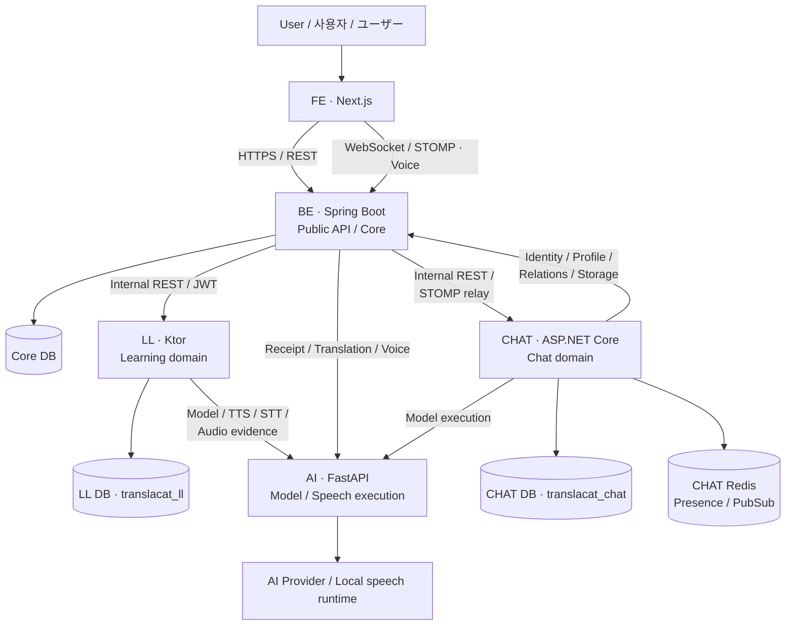
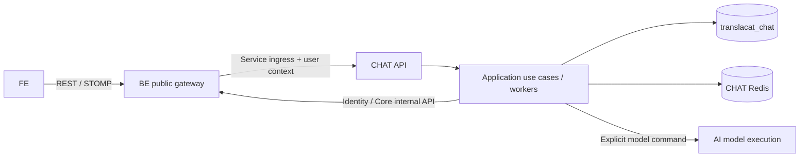
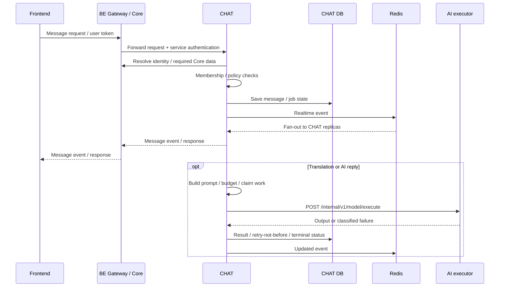

# TranslaCat Chat Service

> 채팅·번역·AI 대화·읽음·Presence를 소유하는 ASP.NET Core 서비스  
> チャット・翻訳・AI会話・既読・Presenceを所有するASP.NET Coreサービス

TranslaCat의 FE / BE / AI / CHAT / LL 분리 구조를 설명하는 저장소 안내서입니다. 기술 버전과 경로는 2026-09-27 제공 소스 기준이며, 실행 환경의 실제 배포 상태나 테스트 통과를 의미하지 않습니다.  
TranslaCatのFE / BE / AI / CHAT / LL分離構成を説明するリポジトリガイドです。技術バージョンとパスは2026-09-27提供ソースを基準とし、実環境でのデプロイ状態やテスト成功を示すものではありません。

[개요 / 概要](#overview) · [구조 / 構成](#architecture) · [인증 / 認証](#authentication) · [실행 / 起動](#setup) · [설정 / 設定](#configuration) · [테스트 / テスト](#tests) · [운영 / 運用](#operations)

---

<a id="overview"></a>

## 1. 개요 / 概要

TranslaCat Chat Service는 기존 BE 및 AI에 있던 채팅 업무를 분리한 서비스입니다. 방과 멤버, 메시지, 읽음 커서, 번역 작업, AI 멤버와 대화, 실시간 이벤트, Presence를 관리하며 전용 MySQL catalog와 Redis를 사용합니다.  
TranslaCat Chat Serviceは従来BEとAIにあったチャット業務を分離したサービスです。ルームとメンバー、メッセージ、既読cursor、翻訳job、AIメンバーと会話、リアルタイムevent、Presenceを管理し、専用MySQL catalogとRedisを使用します。

계정의 최종 식별·공통 프로필·친구/차단 관계·공통 이미지 저장은 BE 내부 API를 사용합니다. 모델 실행은 AI의 범용 실행 API를 사용하지만, 채팅용 프롬프트·문맥·번역/AI 작업 상태·재시도 정책은 CHAT에 둡니다.  
アカウントの最終識別・共通プロフィール・友達/ブロック関係・共通画像保存にはBE内部APIを使用します。モデル実行にはAIの汎用実行APIを使いますが、チャット用prompt・文脈・翻訳/AI job状態・再試行方針はCHATに置きます。

첨부 소스에는 루트 README가 없어 이 문서를 새로 구성했습니다. 기존 `deploy/chat/README.md`의 배포·인증·Redis 설명을 활용하되, 과거 단계의 테스트 수와 검증 기록을 새 실행 결과로 재사용하지 않습니다. 해당 배포 문서의 상태 표기는 `NOT_DEPLOYED / CUTOVER_PENDING`입니다.  
提供ソースにはroot READMEがないため本書を新規構成しました。既存`deploy/chat/README.md`の配置・認証・Redis説明を活用しつつ、過去段階のテスト件数や検証記録を新たな実行結果として再利用しません。同配置文書の状態表記は`NOT_DEPLOYED / CUTOVER_PENDING`です。

**관련 소스 / 関連ソース:** [Existing deployment guide](deploy/chat/README.md) · [Application entrypoint](TranslaCat.Chat.Api/Program.cs)

---

<a id="architecture"></a>

## 2. 시스템에서의 위치 / システム内での位置付け



DB 상자는 데이터 책임과 논리 catalog를 나타냅니다. 이 그림만으로 서로 다른 물리 DB 서버·배포 호스트·고가용성 구성을 의미하지 않습니다. Storage 및 인증 공급자의 세부 연결은 각 기능 절에서 설명합니다.  
DBの箱はデータ責務と論理catalogを表します。この図だけで別々の物理DBサーバー・配置ホスト・高可用性構成を意味するものではありません。Storageと認証プロバイダーの詳細接続は各機能節で説明します。



기본 브라우저 WebSocket 진입점은 BE의 `/ws/chat`이며, BE가 CHAT의 `/ws/chat`으로 중계합니다. CHAT 구현은 STOMP 프로토콜 처리와 broker를 직접 갖고 있으며 SignalR 기반이라고 설명하지 않습니다. BE 경유와 CHAT 직접 접속을 같은 보안 경로로 취급하지 않습니다.  
標準のブラウザーWebSocket入口はBEの`/ws/chat`で、BEがCHATの`/ws/chat`へ中継します。CHAT実装はSTOMP protocol処理とbrokerを持ち、SignalR基盤としては説明しません。BE経由とCHATへの直接接続を同じsecurity経路として扱いません。

---

## 3. 기술 스택과 솔루션 구성 / 技術スタックとSolution構成

| 구분 / 区分 | 선언된 기술 / 宣言された技術 |
| --- | --- |
| Language / Runtime | C# · .NET 10 / net10.0 |
| API | ASP.NET Core · OpenAPI |
| Persistence | EF Core 10.0.12 · MySql.EntityFrameworkCore 10.0.9 · MySql.Data 26.7.0 |
| Redis | StackExchange.Redis 3.3.1 |
| Realtime | WebSocket · STOMP codec / broker · Redis Pub/Sub |
| Authentication | 사용자 JWT + 방향별 HS256 service token<br/>ユーザーJWT + 方向別HS256 service token |
| Container | SDK 10.0.401-noble · ASP.NET runtime 10.0.12-noble |
| Deployment Redis | redis:7.4.10-alpine, 소스의 digest pin 유지 / ソースのdigest pinを維持 |
| Verification | UnitTests · ApiTests · IntegrationTests · PowerShell probes |

| 프로젝트 / プロジェクト | 주요 책임 / 主な責務 |
| --- | --- |
| `TranslaCat.Chat.Api` | HTTP/WS·인증·설정·readiness·실시간 연결<br/>HTTP/WS・認証・設定・readiness・リアルタイム接続 |
| `TranslaCat.Chat.Application` | 방/멤버/메시지 use case·AI/번역 정책·작업 실행·port<br/>ルーム/メンバー/メッセージuse case・AI/翻訳方針・job実行・port |
| `TranslaCat.Chat.Domain` | 읽음 커서 등 독립적인 도메인 규칙<br/>既読cursorなどの独立したdomain規則 |
| `TranslaCat.Chat.Infrastructure` | EF/MySQL·Redis·BE/AI HTTP adapter·migration<br/>EF/MySQL・Redis・BE/AI HTTP adapter・migration |

프로젝트 분리가 모든 업무 규칙이 Domain 프로젝트에 모여 있다는 뜻은 아닙니다. 현재 AI·번역 정책과 여러 use case는 Application에 구현되어 있습니다. 실제 파일 배치를 기준으로 수정 책임을 찾습니다.  
Project分割は、すべての業務規則がDomain projectに集まっていることを意味しません。現在のAI・翻訳方針と各use caseはApplicationに実装されています。実際のfile配置を基準に変更責務を探します。

**관련 소스 / 関連ソース:** [Solution](CatPjt-TranslaCat-chat.slnx) · [API project](TranslaCat.Chat.Api/TranslaCat.Chat.Api.csproj) · [Infrastructure project](TranslaCat.Chat.Infrastructure/TranslaCat.Chat.Infrastructure.csproj) · [Docker](deploy/chat/Dockerfile)

---

## 4. 주요 기능 / 主な機能

| 영역 / 領域 | 기능 / 機能 |
| --- | --- |
| 방·멤버 / ルーム・メンバー | 친구 1:1·그룹방, 초대, 멤버 관리, 방 프로필<br/>友達1対1・グループ、招待、メンバー管理、ルームprofile |
| 오픈 채팅 / オープンチャット | 방 탐색·입장/퇴장·프로필·관리자·차단·소유권 이전·폐쇄<br/>検索・参加/退出・profile・管理者・ban・所有権移譲・閉鎖 |
| 메시지·읽음 / メッセージ・既読 | 메시지 저장·페이지/anchor 조회·읽음 cursor·실시간 반영<br/>保存・page/anchor取得・既読cursor・リアルタイム反映 |
| 번역 / 翻訳 | 사용자/방 언어 설정·번역 작업·재시도·상태 복구<br/>ユーザー/ルーム言語設定・翻訳job・再試行・状態復旧 |
| AI 채팅 / AIチャット | AI 멤버·방별 AI 설정·답변·Revival 작업·운영 설정<br/>AIメンバー・ルーム別AI設定・応答・Revival job・運用設定 |
| 알림 / 通知 | 활동/채팅 요약·조회·읽음 처리<br/>活動/チャットsummary・取得・既読処理 |
| Presence | 다중 연결·TTL lease·offline grace·Pub/Sub fan-out<br/>複数接続・TTL lease・offline grace・Pub/Sub fan-out |

프로필·친구·차단·저장소 연동이 필요하다는 이유로 공통 계정 DB를 CHAT이 직접 수정하지 않습니다. 계정 소유 서비스인 BE와 내부 계약으로 연결하고, 채팅 데이터는 CHAT catalog에서 변경합니다.  
profile・友達・block・storage連携が必要だからといって、CHATが共通アカウントDBを直接更新することはありません。アカウントを所有するBEと内部契約で接続し、チャットdataはCHAT catalogで更新します。

**관련 소스 / 関連ソース:** [Application](TranslaCat.Chat.Application) · [HTTP API](TranslaCat.Chat.Api) · [Persistence](TranslaCat.Chat.Infrastructure/Persistence)

---

## 5. 메시지·번역·AI 처리 흐름 / メッセージ・翻訳・AI処理フロー



메시지 원문 저장과 이후 번역·AI 결과의 준비 상태를 구분합니다. Provider 응답을 받았다는 이유만으로 현재 작업 소유권·revision·멤버 조건을 무시하고 덮어쓰지 않도록 작업 저장소와 처리 lease를 사용합니다.  
メッセージ原文の保存と、その後の翻訳・AI結果の準備状態を区別します。Provider応答を受け取っただけで現在のjob所有権・revision・member条件を無視して上書きしないよう、job storeと処理leaseを使用します。

AI 호출의 기술 오류와 재시도 가능한 시각을 CHAT 정책에서 해석합니다. `Retry-After`가 현재 HTTP 재시도 예산을 넘으면 즉시 재호출하는 대신 번역/Revival 작업의 재시도 시각에 반영하는 경로가 있습니다. 응답·번역·Revival의 정책 파일을 각각 확인하며 하나의 무제한 retry로 묶지 않습니다.  
AI呼び出しの技術エラーと再試行可能時刻はCHAT方針で解釈します。`Retry-After`が現在のHTTP retry予算を超える場合、即時再呼び出しではなく翻訳/Revival jobの再試行時刻へ反映する経路があります。応答・翻訳・Revivalの各方針fileを確認し、一つの無制限retryとして扱いません。

**관련 소스 / 関連ソース:** [AI use cases](TranslaCat.Chat.Application/Ai) · [Translation use cases](TranslaCat.Chat.Application/Translation) · [Model execution transport](TranslaCat.Chat.Infrastructure/Ai/ChatModelExecutionTransport.cs) · [Migrations](TranslaCat.Chat.Infrastructure/Persistence/Migrations)

---

## 6. Redis·Presence·읽음 데이터 / Redis・Presence・既読data

| 데이터 / データ | 소유 / 所有 | 복구 특성 / 復旧特性 |
| --- | --- | --- |
| 방·멤버·메시지·읽음·AI/번역 작업<br/>ルーム・メンバー・メッセージ・既読・AI/翻訳job | MySQL / CHAT | 업무 영속 데이터 / 業務永続data |
| 세션 lease / セッションlease | Redis | TTL 기반의 일시 연결 상태 / TTLによる一時接続状態 |
| Presence 전이 / 遷移 | Redis | ONLINE/OFFLINE 중복 전이 억제 / 重複遷移抑止 |
| Presence·읽음/방 이벤트 / Presence・既読/ルームevent | Redis Pub/Sub | 지속 저장·재생 없음; 상태는 DB/재연결로 복구<br/>永続保存・replayなし。状態はDB/再接続で復旧 |

기본 Presence는 session lease 60초, refresh 20초, offline grace 30초를 사용합니다. 끊어진 연결 ID를 다른 프로세스에 복사해 복원하지 않고 재연결로 등록합니다. Offline 판정은 grace 이전에 앞당기지 않으며 실제 알림은 polling·부하만큼 늦어질 수 있습니다.  
標準Presenceはsession lease 60秒、refresh 20秒、offline grace 30秒を使用します。切断済み接続IDを別processへコピーして復元せず、再接続で登録します。Offline判定をgraceより前へ早めず、実通知はpolling・負荷に応じて遅れる場合があります。

```text
<scope>:user:{id}:session:<sessionId>
<scope>:user:{id}:sessions
<scope>:user:{id}:state
<scope>:presence:events
<scope>:realtime:events
```

동일 환경의 CHAT replica는 같은 namespace를 쓰고, 다른 환경은 분리합니다. Redis DB 번호는 Pub/Sub 채널 격리를 대신하지 않습니다. 현재 배포 Redis는 연결 상태와 Pub/Sub용이므로 영속 메시지 큐처럼 설명하지 않습니다.  
同一環境のCHAT replicaは同じnamespaceを使用し、別環境は分離します。Redis DB番号はPub/Sub channelの隔離を代替しません。現在の配置Redisは接続状態とPub/Sub用であり、永続message queueとしては説明しません。

배포 스크립트는 namespace별 key/channel ACL을 구성하고 Redis를 내부 네트워크에 한정합니다. Redis 장애와 메시지 영속 데이터 소실을 동일시하지 않되, 이벤트 전달·Presence·readiness 영향은 별도로 관측합니다.  
配置scriptはnamespaceごとのkey/channel ACLを構成し、Redisを内部networkに限定します。Redis障害とメッセージ永続dataの喪失を同一視しませんが、event配信・Presence・readinessへの影響は別途観測します。

**관련 소스 / 関連ソース:** [Redis implementation](TranslaCat.Chat.Infrastructure/Redis) · [Realtime](TranslaCat.Chat.Api/Realtime) · [Redis startup / ACL](deploy/chat/start-chat-redis.sh)

---

<a id="authentication"></a>

## 7. 인증·권한과 방향별 키 / 認証・認可と方向別キー

| 방향 / 方向 | 인증 / 認証 | 분리 원칙 / 分離原則 |
| --- | --- | --- |
| User → BE → CHAT | 기존 사용자 JWT 계약 / 既存ユーザーJWT契約 | 기존 발급자와 서명 계약을 유지<br/>既存発行元・署名契約を維持 |
| BE → CHAT | 전용 HS256 service token / 専用HS256 service token | 사용자 JWT 및 반대 방향 service key와 분리<br/>ユーザーJWT・逆方向service keyから分離 |
| CHAT → BE Identity / Core | 전용 HS256 service token / 専用HS256 service token | 같은 방향 내 identity/Core는 tokenUse·scope 구분<br/>同方向内のidentity/CoreはtokenUse・scopeを区別 |
| CHAT → AI | CHAT 전용 raw API key / CHAT専用raw API key | 답변·번역이 같은 방향키 사용 가능; AI global/LL key와 분리<br/>応答・翻訳は同方向key共有可能。AI global/LL keyとは分離 |

키가 존재하는 것과 해당 계정·공통 프로필·스토리지 adapter가 구현·연결된 것은 다릅니다. 내부 서비스 인증 뒤에도 사용자 식별과 채팅방 멤버·관리자 권한을 검증합니다. 브라우저가 내부 service header를 직접 주입하는 경로를 허용하지 않습니다.  
キーが存在することと、アカウント・共通profile・storage adapterが実装・接続されたことは異なります。内部service認証後もユーザー識別とルームmember・管理者権限を検証します。ブラウザーが内部service headerを直接注入する経路は許可しません。

`DOTNET_ENVIRONMENT`와 `ASPNETCORE_ENVIRONMENT`를 함께 지정하면 정확히 같아야 합니다. 일반 실행은 `Development`와 `Production` 계약을 따르고 `Local`/`Prod` 별칭으로 우회하지 않습니다. Production에는 테스트 모드와 placeholder 비밀정보를 넘기지 않습니다.  
`DOTNET_ENVIRONMENT`と`ASPNETCORE_ENVIRONMENT`を同時指定する場合は完全一致が必要です。通常実行は`Development`と`Production`契約に従い、`Local`/`Prod`別名で迂回しません。Productionへtest modeやplaceholder秘密情報を渡しません。

**관련 소스 / 関連ソース:** [Configuration validation](TranslaCat.Chat.Api/Configuration/ChatConfiguration.cs) · [Outbound configuration](TranslaCat.Chat.Api/Configuration/ChatOutboundConfiguration.cs) · [BE example](deploy/be/chat-internal.properties.example) · [AI example](deploy/ai/chat-auth.env.example)

---

## 8. 대표 API와 실시간 경로 / 代表APIとリアルタイム経路

| Method | 경로 / パス | 용도 / 用途 |
| --- | --- | --- |
| GET | `/api/health` | liveness |
| GET | `/api/ready` | readiness |
| WS | `/ws/chat` | STOMP 연결 / STOMP接続 |
| GET / POST | `/api/v1/chat/rooms` | 방 목록·생성 / 一覧・作成 |
| GET | `/api/v1/chat/rooms/{chatRoomId}` | 방 상세 / ルーム詳細 |
| GET / POST | `/api/v1/chat/rooms/{chatRoomId}/messages` | 메시지 조회·전송 / メッセージ取得・送信 |
| PATCH | `/api/v1/chat/rooms/{chatRoomId}/read` | 읽음 커서 / 既読cursor |
| GET / PATCH | `/api/v1/users/me/chat-language-settings` | 사용자 채팅 언어 / ユーザーチャット言語 |
| POST | `/api/v1/chat/rooms/{chatRoomId}/messages/{messageId}/translations/{languageCode}/retry` | 번역 재시도 / 翻訳再試行 |
| GET / POST | `/api/v1/chat/open-rooms` | 오픈 채팅 / オープンチャット |
| GET / PATCH | `/api/v1/admin/chat/ai-settings` | 관리자 AI 정책 / 管理者AI方針 |

표는 대표 경계만 요약합니다. 초대·프로필·언어 설정·AI 멤버·운영 API와 세부 payload는 API endpoint 소스를 기준으로 확인합니다. 개발 환경에서는 `MapOpenApi()`로 OpenAPI를 제공하며, 별도의 Swagger UI가 자동 포함된다고 가정하지 않습니다.  
表は代表的な境界のみを要約しています。招待・profile・言語設定・AI member・運営APIと詳細payloadはAPI endpointソースを基準に確認します。開発環境では`MapOpenApi()`でOpenAPIを提供し、別途Swagger UIが自動で含まれるとは仮定しません。

**관련 소스 / 関連ソース:** [HTTP endpoint definitions](TranslaCat.Chat.Api) · [STOMP codec](TranslaCat.Chat.Api/Realtime/ChatStompCodec.cs) · [Entrypoint / OpenAPI](TranslaCat.Chat.Api/Program.cs)

---

<a id="setup"></a>

## 9. 로컬 실행 준비 / ローカル起動準備

.NET 10 SDK와 PowerShell 7을 준비합니다. 실제 업무 실행에는 CHAT MySQL catalog, Redis, BE 내부 API, AI 실행 API, 사용자 JWT 및 방향별 서비스 키, 명시적 시간대·Origin 설정이 필요합니다. 기본 appsettings는 상대 서비스 기능을 활성화하지 않으므로 단순 실행만으로 전체 준비 상태가 되지 않습니다.  
.NET 10 SDKとPowerShell 7を用意します。実業務実行にはCHAT MySQL catalog、Redis、BE内部API、AI実行API、ユーザーJWTと方向別service key、明示的なtimezone・Origin設定が必要です。標準appsettingsは相手service機能を有効化しないため、単純起動だけで全体準備完了にはなりません。

```powershell
dotnet --info
dotnet restore CatPjt-TranslaCat-chat.slnx
dotnet build CatPjt-TranslaCat-chat.slnx --no-restore
```

공개 소스에는 `Initialize-ChatDevelopment.ps1`와 `Start-ChatDevelopment.ps1`가 있지만, 이들이 기본값으로 참조하는 `deploy/local/Development.json`은 제공 ZIP에 없습니다. 존재하지 않는 manifest를 준비 완료로 가정하지 말고, 직접 준비한 User Secrets 또는 아래의 명시적 JSON 실행 경로를 사용합니다.  
公開ソースには`Initialize-ChatDevelopment.ps1`と`Start-ChatDevelopment.ps1`がありますが、defaultで参照する`deploy/local/Development.json`は提供ZIPにありません。存在しないmanifestを準備済みと仮定せず、自分で用意したUser Secretsまたは次の明示的JSON起動経路を使用します。

`Start-ChatLocal.ps1`의 JSON은 중첩 객체가 아닌 환경변수 이름 → 문자열 값 사전입니다. 실제 secret은 허용된 `_FILE` 이름과 저장소 밖의 존재하는 절대 경로로 넘깁니다. 아래는 형식 예시일 뿐, 전체 동작에 필요한 모든 항목을 채운 설정 파일이 아닙니다.  
`Start-ChatLocal.ps1`のJSONは入れ子objectではなく、環境変数名 → 文字列値の辞書です。実secretは許可された`_FILE`名とリポジトリ外の実在する絶対pathで渡します。次は形式例であり、全動作に必要な全項目を埋めた設定fileではありません。

```json
{
  "Chat__Database__ConnectionString_FILE": "C:/private/translacat/chat-database-connection",
  "Chat__Core__Enabled": "true",
  "Chat__Core__BaseUrl": "http://127.0.0.1:8080",
  "Chat__Realtime__AllowedOrigins__0": "http://localhost:3000"
}
```

```powershell
pwsh -NoProfile -File ./scripts/Start-ChatLocal.ps1 -Environment Development -Port 5079 -ConfigurationFile C:/private/translacat/chat-local-environment.json -ValidateOnly
pwsh -NoProfile -File ./scripts/Start-ChatLocal.ps1 -Environment Development -Port 5079 -ConfigurationFile C:/private/translacat/chat-local-environment.json -ValidateConfiguration
pwsh -NoProfile -File ./scripts/Start-ChatLocal.ps1 -Environment Development -Port 5079 -ConfigurationFile C:/private/translacat/chat-local-environment.json
```

`-ValidateOnly`는 파일·인자 형태 검사입니다. `-ValidateConfiguration`은 managed 설정 바인딩·검증만 수행하고 서버/worker·실 외부 연결을 시작하지 않습니다. 두 검사를 실제 통합 테스트와 혼동하지 않습니다.  
`-ValidateOnly`はfile・引数形式の検査です。`-ValidateConfiguration`はmanaged設定binding・検証のみを行い、サーバー/worker・実外部接続を開始しません。どちらも実統合テストとは区別します。

**관련 소스 / 関連ソース:** [Local launcher](scripts/Start-ChatLocal.ps1) · [Default settings](TranslaCat.Chat.Api/appsettings.json) · [Development key tool](scripts/New-ChatDevelopmentKeys.ps1)

---

<a id="configuration"></a>

## 10. 환경설정과 비밀 파일 / 環境設定と秘密ファイル

| 설정 경로 / 設定path | 용도 / 用途 |
| --- | --- |
| `Chat:Database:ConnectionString` | `Database=translacat_chat`; runtime DML 계정<br/>runtime DMLアカウント |
| `Chat:SourceTimeZone` | 기존 데이터 정책을 확인한 명시적 timezone<br/>既存data方針を確認した明示timezone |
| `Chat:Authentication` | 사용자 JWT 검증; Enabled / Base64SigningKey<br/>ユーザーJWT検証 |
| `Chat:ServiceAuthentication:Ingress` | BE → CHAT 서비스 인증 / BE → CHAT service認証 |
| `Chat:Identity` · `Chat:Core` | BE endpoint·서비스 인증·기능 활성화<br/>BE endpoint・service認証・機能有効化 |
| `Chat:Ai` · `Chat:Translation` | AI base URI·전용 API key·timeout·retry 설정<br/>AI base URI・専用API key・timeout・retry設定 |
| `Chat:Redis` | ConnectionString 또는 Endpoint/User/Password/TLS 설정<br/>ConnectionStringまたはstructured設定 |
| `Chat:Redis:Namespace` | 환경별 key/channel 격리 / 環境別key/channel隔離 |
| `Chat:Presence` | Enabled·SessionTtl·RefreshInterval·OfflineGrace |
| `Chat:Realtime:AllowedOrigins` | 실제 브라우저 Origin allowlist / 実ブラウザーOrigin allowlist |
| `AllowedHosts` | 실제 ingress의 Host 허용 설정 / 実ingressのHost許可設定 |

환경변수는 `Chat__Core__BaseUrl`처럼 이중 밑줄로 계층을 표현합니다. `_FILE`은 .NET 자체 자동 기능이 아니라 이 저장소의 allowlist 구현입니다. 같은 secret의 원문 값과 파일을 동시에 지정하면 거절하며, 모든 임의 설정에 `_FILE`을 붙일 수 있는 것은 아닙니다.  
環境変数は`Chat__Core__BaseUrl`のように二重underscoreで階層を表します。`_FILE`は.NET自体の自動機能ではなく、このリポジトリのallowlist実装です。同secretの原文値とfileを同時指定すると拒否され、任意の全設定へ`_FILE`を付けられるわけではありません。

개발 키 도구는 Development용 방향키만 생성·보존하며, 운영키 생성이나 기존 사용자 JWT 체계 변경을 수행하지 않습니다. DB·Redis 자격증명은 별도 준비합니다. Compose `.env`는 interpolation 입력이고, User Secrets나 직접 dotnet 실행 설정과 자동 공유되지 않습니다.  
開発key toolはDevelopment向け方向keyのみを生成・保持し、本番key生成や既存ユーザーJWT体系の変更は行いません。DB・Redis資格情報は別途用意します。Compose `.env`はinterpolation入力であり、User Secretsや直接dotnet実行設定と自動共有されません。

**관련 소스 / 関連ソース:** [Config provider / validation](TranslaCat.Chat.Api/Configuration/ChatConfiguration.cs) · [Local Compose example](deploy/chat/.env.local.example) · [Production Compose example](deploy/chat/.env.prod.example) · [Auth overlay](deploy/chat/compose.internal-auth.yaml)

---

## 11. DB 초기화와 migration / DB初期化とmigration

CHAT 업무 catalog는 `translacat_chat`입니다. API startup은 migration·seed·기존 BE DB 복사를 자동 실행하지 않습니다. runtime DML 계정과 schema 변경 권한을 분리하고, 대상 catalog와 데이터 보존 방침을 확인한 후 별도 migration 절차를 사용합니다.  
CHAT業務catalogは`translacat_chat`です。API startupはmigration・seed・既存BE DBコピーを自動実行しません。runtime DMLアカウントとschema変更権限を分離し、対象catalogとdata保持方針を確認してから別migration手順を使用します。

다음 명령은 schema를 변경합니다. 전용 migration 연결 문자열을 보관한 파일을 직접 준비한 뒤 해당 환경에서만 실행합니다. API project가 아니라 Infrastructure project를 startup project로 지정합니다.  
次のコマンドはschemaを変更します。専用migration接続文字列を保存したfileを用意し、対象環境でのみ実行します。API projectではなくInfrastructure projectをstartup projectに指定します。

```powershell
dotnet tool restore
dotnet build TranslaCat.Chat.Infrastructure/TranslaCat.Chat.Infrastructure.csproj
$env:CHAT_DATABASE_CONNECTION_FILE = "C:/private/translacat/chat-migration-connection"
dotnet ef database update --project TranslaCat.Chat.Infrastructure --startup-project TranslaCat.Chat.Infrastructure --no-build
Remove-Item Env:CHAT_DATABASE_CONNECTION_FILE
```

기존 BE의 데이터 이관이나 초기화가 이 명령에 포함된다고 가정하지 않습니다.  
既存BEのdata移行や初期化が、このコマンドに含まれるとは仮定しません。

**관련 소스 / 関連ソース:** [Design-time factory](TranslaCat.Chat.Infrastructure/Persistence/ChatDesignTimeDbContextFactory.cs) · [Migration files](TranslaCat.Chat.Infrastructure/Persistence/Migrations) · [Tool manifest](.config/dotnet-tools.json)

---

## 12. Health와 Readiness / HealthとReadiness

| 경계 / 境界 | 의미 / 意味 |
| --- | --- |
| `GET /api/health` | 프로세스 생존 / プロセス生存 |
| `GET /api/ready` | DB·migration·Redis·realtime·인증·adapter 구성 상태 확인<br/>DB・migration・Redis・realtime・認証・adapter構成状態確認 |
| `CONFIGURED_NOT_PROBED` | 구성 확인과 실 상대 API 성공은 다름<br/>構成確認と相手APIの実成功は異なる |
| `SourceTimeZone: CONFIGURED_NOT_VERIFIED` | 명시 설정됨; 과거 데이터 시간대 검증 완료를 의미하지 않음<br/>明示設定済み。過去data timezone検証完了は意味しない |

기본 설정에서 `/api/ready`가 `503 NOT_READY`인 것은 필요한 연결과 adapter가 준비되지 않았음을 뜻할 수 있습니다. 가짜 사용자나 인증 우회, probe 결과 강제 변경으로 200을 만들지 않습니다. 반대로 200도 실제 Google 로그인·Provider 답변·브라우저 전체 흐름의 성공을 증명하지 않습니다.  
標準設定で`/api/ready`が`503 NOT_READY`になるのは、必要接続やadapterが未準備であることを示す場合があります。架空ユーザー、認証迂回、probe結果の強制変更で200にしません。逆に200も、実Googleログイン・Provider応答・ブラウザー全体フローの成功を証明するものではありません。

**관련 소스 / 関連ソース:** [Readiness logic](TranslaCat.Chat.Api/Runtime/ChatReadiness.cs)

---

## 13. 디렉터리 구조 / ディレクトリ構成

```text
CatPjt-TranslaCat-chat.slnx
TranslaCat.Chat.Api/
├─ Configuration/
├─ Realtime/
├─ Runtime/
└─ Program.cs
TranslaCat.Chat.Application/
├─ Ai/
└─ Translation/              # plus chat use cases / ports
TranslaCat.Chat.Domain/
TranslaCat.Chat.Infrastructure/
├─ Ai/
├─ Persistence/
│  ├─ Entities/
│  ├─ Configurations/
│  └─ Migrations/
└─ Redis/
TranslaCat.Chat.UnitTests/
TranslaCat.Chat.ApiTests/
TranslaCat.Chat.IntegrationTests/
scripts/
deploy/
├─ chat/                    # Compose / Docker / ACL / examples
├─ be/                      # BE integration example
└─ ai/                      # AI integration example
```

---

<a id="tests"></a>

## 14. 테스트와 재현 가능한 검증 / テストと再現可能な検証

```powershell
dotnet test TranslaCat.Chat.UnitTests/TranslaCat.Chat.UnitTests.csproj
dotnet test TranslaCat.Chat.ApiTests/TranslaCat.Chat.ApiTests.csproj
```

IntegrationTests는 전용 MySQL·Redis와 소유권이 확인되는 runtime manifest를 사용합니다. 테스트 fixture는 운영 catalog나 다른 서비스 runtime으로 대체하지 않습니다. 현재 보조 스크립트는 Windows PowerShell 환경·DPAPI와 특정 dotnet 설치 경로를 전제로 하므로 Linux 공통 실행 명령으로 설명하지 않습니다.  
IntegrationTestsは専用MySQL・Redisと所有権を確認できるruntime manifestを使用します。test fixtureを本番catalogや他service runtimeで置き換えません。現在の補助scriptはWindows PowerShell環境・DPAPIと特定dotnet配置pathを前提にするため、Linux共通コマンドとしては説明しません。

Docker가 동작하고 스크립트가 요구하는 `mysql:8.4`, `redis:7.4.10-alpine` 이미지가 로컬에 준비되어 있어야 합니다. 스크립트는 `--pull=never`를 사용합니다. 첫 명령이 출력한 manifest의 실제 절대 경로를 다음 두 명령에 넣습니다.  
Dockerが動作し、scriptが必要とする`mysql:8.4`、`redis:7.4.10-alpine` imageがローカルに必要です。scriptは`--pull=never`を使用します。最初のコマンドが出力したmanifestの実絶対pathを、次の二つのコマンドへ指定します。

```powershell
pwsh -NoProfile -File ./scripts/Start-ChatIntegrationRuntime.ps1
pwsh -NoProfile -File ./scripts/Invoke-ChatIntegration.ps1 -Manifest <absolute-runtime-manifest.json> test TranslaCat.Chat.IntegrationTests/TranslaCat.Chat.IntegrationTests.csproj
pwsh -NoProfile -File ./scripts/Stop-ChatIntegrationRuntime.ps1 -Manifest <absolute-runtime-manifest.json>
```

위 `<...>`는 실제 경로로 교체할 자리이며 그대로 실행할 문법이 아닙니다. 생성/정리 도구는 container ID·run label·manifest 경계를 확인합니다. 일반 개발 DB 삭제, 전체 Redis flush, 다른 BE/LL runtime 중단을 테스트 정리 절차에 추가하지 않습니다.  
上記`<...>`は実pathへ置き換える箇所であり、そのまま実行する構文ではありません。生成/cleanup toolはcontainer ID・run label・manifest境界を確認します。通常開発DB削除、全Redis flush、他BE/LL runtime停止をtest cleanup手順へ追加しません。

이 README 작성에서는 build·단위/통합 테스트·컨테이너 실행을 수행하지 않았습니다. 배포 가이드의 이전 MySQL/Redis/브라우저 결과와 새 실행 결과는 구분하고, 검증하려는 소스 조합과 실제 연결 대상을 함께 기록합니다.  
今回のREADME作成ではbuild・単体/統合テスト・container実行は行っていません。配置guideの過去MySQL/Redis/ブラウザー結果と新実行結果を分け、検証対象のソース組み合わせと実接続先を併記します。

**관련 소스 / 関連ソース:** [Unit tests](TranslaCat.Chat.UnitTests) · [API tests](TranslaCat.Chat.ApiTests) · [Integration tests](TranslaCat.Chat.IntegrationTests) · [Runtime creation](scripts/Start-ChatIntegrationRuntime.ps1) · [Runtime test wrapper](scripts/Invoke-ChatIntegration.ps1) · [Owned runtime cleanup](scripts/Stop-ChatIntegrationRuntime.ps1)

---

<a id="operations"></a>

## 15. 배포와 운영 시 주의사항 / 配置と運用上の注意

배포 Compose는 API와 CHAT 전용 Redis를 별도 container로 실행하고, 기본 API host binding은 `127.0.0.1:5085`입니다. Redis는 host port를 공개하지 않습니다. DB container는 기본 배포 구성에 포함되어 있지 않으므로 준비된 MySQL에 연결해야 합니다.  
配置ComposeはAPIとCHAT専用Redisを別containerで実行し、標準API host bindingは`127.0.0.1:5085`です。Redisはhost portを公開しません。DB containerは標準配置構成に含まれないため、準備済みMySQLへ接続します。

`.env.local.example`/`.env.prod.example`에는 실제 host·secret 경로·timezone 등 필수 입력이 비어 있습니다. 복사만으로 실행 준비가 완료되지는 않습니다. 내부 인증에는 `compose.internal-auth.yaml`을 함께 적용하고, 먼저 비밀 원문을 출력하지 않는 구성 검사를 수행합니다.  
`.env.local.example`/`.env.prod.example`には実host・secret path・timezoneなどの必須入力が空欄です。コピーだけで実行準備が完了するわけではありません。内部認証には`compose.internal-auth.yaml`を合わせて適用し、まず秘密原文を出力しない構成検査を行います。

```powershell
docker compose --env-file deploy/chat/.env.local -f deploy/chat/compose.yaml -f deploy/chat/compose.internal-auth.yaml config --quiet
```

실제 cutover 전에는 단일 writer/worker, 사용자 ID·읽음 cursor·참조 관계, source timezone, WS upgrade/timeout/disconnect, TLS·Origin·키 교체, 재연결·복구·rollback을 검증합니다. 같은 host의 API+Redis는 HA가 아니며, PING 성공은 쓰기 여유나 전체 업무 성공을 보장하지 않습니다.  
実cutover前にはsingle writer/worker、ユーザーID・既読cursor・参照関係、source timezone、WS upgrade/timeout/disconnect、TLS・Origin・key rotation、再接続・復旧・rollbackを検証します。同一hostのAPI+RedisはHAではなく、PING成功も書き込み余力や全業務成功を保証しません。

기존 배포 문서가 가리키는 외부 Docs 저장소와 과거 검증 장부는 이 소스 ZIP에 포함되어 있지 않습니다. 이 README는 존재하는 소스와 배포 파일을 안내하며, 미제공 장부의 완료 상태를 추정하지 않습니다.  
既存配置文書が参照する外部Docsリポジトリと過去検証台帳はこのソースZIPに含まれていません。本READMEは実在するソースと配置fileを案内し、未提供台帳の完了状態を推測しません。

**관련 소스 / 関連ソース:** [Deployment details](deploy/chat/README.md) · [Base Compose](deploy/chat/compose.yaml) · [Internal-auth overlay](deploy/chat/compose.internal-auth.yaml) · [Deployment config tests](scripts/Test-ChatDeploymentConfiguration.ps1)

---

### 문서 변경과 배포 / 文書変更と配置

이 저장소의 `.github/workflows/deploy.yaml`은 main push를 처리하는 배포 workflow입니다. 문서만 변경해도 실행 조건에 해당할 수 있으므로 작업 branch와 workflow 조건을 확인하고, README 검토를 운영 배포 승인과 분리합니다.  
このリポジトリの`.github/workflows/deploy.yaml`はmain pushを処理する配置workflowです。文書だけの変更でも実行条件に該当し得るため、作業branchとworkflow条件を確認し、README確認と本番配置承認を分離します。

**관련 소스 / 関連ソース:** [Workflow](.github/workflows/deploy.yaml)
